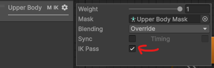

# FK와 IK

&#x20;FK는 Forward Kinematics, 정기구학이라고 한다. 이게 물리의 로봇 공학 기초에 나오는데 자세한 것들은 나도 모른다. FK의 설명에는 조인트(joint) 개념이 있는데 조인트는 두 축을 결합하는 부분을 말한다. 흔히 쪼인트 깐다? 라고 할 때 관절에 해당하는 그런 느낌인 것 같다. 유니티에서는 hierarchy하기 때문에 상, 하 조인트보다는 부모 조인트와 자식 조인트로 구분한다. FK 에서는 부모 조인트에서 자식 조인트 순서로 움직임을 적용한다. 자식 조인트는 부모 조인트에 종속되어 있기 때문에 부모 조인트가 움직이면 자식 조인트도 함께 움직인다.

&#x20;예를 들어 FK로 물건을 집는 애니메이션을 재생할 때

* 어깨를 움직인다. 어깨에는 팔이 종속되어 있다.
* 팔을 움직인다. 팔에는 손이 종속되어 있다.
* 손을 움직인다.

&#x20;FK에서 손의 위치는 어깨(부모 조인트)에서 손(자식 조인트)까지 순서대로 누적된 움직임으로 결정된다. 즉, FK에서 손의 위치는 순서대로 계산된 최종 결과이다. **손의 위치를 먼저 정하고 거기에 맞춰 애니메이션을 변형할 수 없다.** 따라서 물건의 위치에 맞춰 손의 위치를 변형할 수 없기 때문에 손의 위치로 물건을 순간이동해야 한다.

&#x20;IK는 Inverse Kinematics, 역운동학?으로 자식 조인트의 위치를 먼저 결정하고 부모 조인트가 거기에 맞춰 변형된다. 이게 뭔가 이해가 잘되는데 우리가 물건을 집을 때 손의 위치를 먼저 생각하고 어깨를 움직이지 어깨의 움직임에 따라 손의 위치를 예상하지 않기 때문이다. 근데 실제로는 FK처럼 행동하긴 한다... 위 FK에서 반대로 이해해보면 물건의 위치에 손이 위치하도록 애니메이션을 변형할 수 있다.

&#x20;IK를 사용하려면 애니메이터 컨트롤러의 layer에서 IK Pass 설정이 켜져 있어야 한다.

<figure><figcaption>
IK Pass
</figcaption></figure>

&#x20;Animator component가 IK 정보를 갱신할 때마다 `OnAnimatorIK`  message가 발생한다. 스크립트에서 IK 정보가 갱신될 때마다 자동 실행되는 `OnAnimatorIK()`메서드를 구현하려면 IK를 어떻게 사용할지 코드로 작성할 수 있다. 예를 들어 FPS에서는 캐릭터의 손이 항상 총의 손잡이에 위치하도록 `OnAnimatorIK()`메서드에서 IK를 사용할 수 있다. 관련 코드는 [여기에서](../undefined-3/animator.md) 확인할 수 있따.
